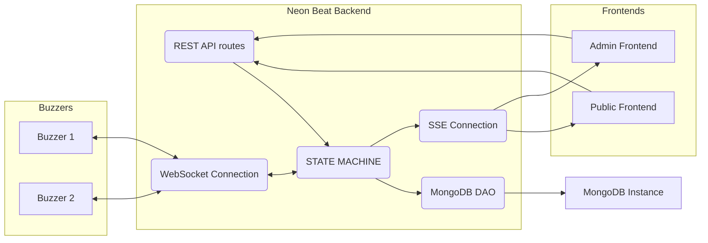

# Neon Beat back

The Neon Beat back project is a Rust backend for the Neon Beat project, a homemade blind test system.

## Features

- **RESTful API**: Provides a well-defined RESTful API for programmatic access to its functionalities.
- **WebSocket buzzer connections**: Supports multiple concurrent buzzer clients. Each buzzer must identify itself on connect (`GET /ws`) by sending JSON:
  ```json
  { "type": "identification", "id": "<mac_address>" }
  ```
  where `<mac_address>` is 12 lowercase hex characters (two digits per byte, no separators, e.g. `deadbeef0001`). The backend remembers connected buzzers so they can reconnect seamlessly.
  Each buzzer must identify itself on buzz by sending JSON:
  ```json
  { "type": "buzz", "id": "<mac_address>" }
  ```
- **Server-Sent Events (SSE)**: Provides two SSE endpoints — `/sse/public` for the public frontend and `/sse/admin` for the admin frontend. The admin stream generates a one-time token and allows only one active admin session at a time.
- **MongoDB persistence**: Uses a MongoDB connection to store game progression and related state.
- **Swagger UI**: The full OpenAPI document is generated with utoipa and served through Swagger UI (`/docs`) for quick manual testing.

## Project Structure

The Neon Beat back project follows a layered architecture, separating concerns into distinct modules:
- **`routes`**: This layer handles incoming HTTP requests and defines the API endpoints. It is responsible for parsing requests, calling the appropriate service methods, and returning HTTP responses.
- **`services`**: This layer contains the business logic of the application. It orchestrates operations, interacts with the `dao` layer to retrieve or store data, and applies any necessary transformations or validations.
- **`dao` (Data Access Object)**: This layer is responsible for interacting with external data sources or systems, such as a MongoDB database. It abstracts the details of data persistence and retrieval from the service layer.
  - **`models`**: This submodule within the `dao` layer defines the data models that represent the entities and structures used when interacting with external systems. These models ensure consistent data representation across the application's interactions with various data sources.
- **`dto` (Data Transfer Object)**: This layer defines the data structures used for transferring data between different layers of the application, particularly between the `routes` and `services` layers, and for external API communication. These structures ensure consistent data formats.

## Workflow diagram


## Build

To build the GOAT binary, ensure you have Rust and Cargo installed. Then, navigate to the project root and run:

```bash
cargo build
```

The compiled binary will be located at `target/debug/neon-beat-back` or `target/release/neon-beat-back`.

## Environment

The server relies on a running MongoDB instance and the following optional environment variables:

| Variable     | Default                     | Description |
|--------------|-----------------------------|-------------|
| `MONGO_URI`  | `mongodb://localhost:27017` | Connection string used to create the MongoDB client. |
| `MONGO_DB`   | `neon_beat`                 | Database name (only used when provided). |
| `PORT`       | `8080`                      | TCP port the HTTP server binds to. `SERVER_PORT` is also honoured for compatibility. |

## Run locally

1. Ensure MongoDB is reachable (configure `MONGO_URI`/`MONGO_DB` as needed).
2. Install Rust toolchain (Rust 1.85+ recommended).
3. From the repository root execute:
```bash
cargo run
```
4. Browse or exercise the following endpoints from your terminal:
   - Healthcheck
     ```bash
     curl http://localhost:8080/healthcheck
     ```
   - Public SSE (stream until Ctrl+C)
     ```bash
     curl -N http://localhost:8080/sse/public
     ```
   - Admin SSE (stream until Ctrl+C; token will be issued on connect)
     ```bash
     curl -N http://localhost:8080/sse/admin
     ```
   - WebSocket (install once, then run)
     ```bash
     cargo install websocat
     ( printf '{"type":"identification","id":"deadbeef0001"}\n'; cat ) | websocat -t ws://localhost:8080/ws
     ```
   - Swagger UI in a browser: open `http://localhost:8080/docs`

## Docker

Build the release image with Docker:

```bash
docker build -t neon-beat-back .
```

For cross-compilation, provide a Rust target triple via the optional build argument:

```bash
docker build -t neon-beat-back --build-arg BUILD_TARGET=aarch64-unknown-linux-gnu .
```

When using docker-compose (e.g. after copying `docker-compose.example.yaml` as `docker-compose.yaml`), the same argument can be passed through an environment variable:

```bash
BUILD_TARGET=aarch64-unknown-linux-gnu docker compose build
```

## Roadmap

- [x] Implement the Rest API with a /healthcheck route
- [x] Implement the WebSocket connection
- [x] Implement the SSE connection
- [x] Implement the MongoDB connection bootstrap
- [x] Implement the Swagger UI documentation
- [x] MongoDB auto-reconnection
- [x] Admin SSE deconnexion management
- [ ] Validate the Rest API /healthcheck route
- [ ] Validate the WebSocket connection
- [ ] Validate the SSE connection
- [ ] Validate the MongoDB connection
- [ ] Manage public SSE deconnexion ?
- [ ] Implement Game State Machine
- [ ] Implement Game State save in DB
- [ ] Implement Playlist State save in DB
- [ ] Implement admin routes (pause, resume, add/remove points, mark field as found, reveal, validate/invalidate answer)
- [ ] Implement public routes (teams, scores, countdown, song url)
- [ ] Implement buzzer feedback
- [ ] Remove useless features of dependencies if found
