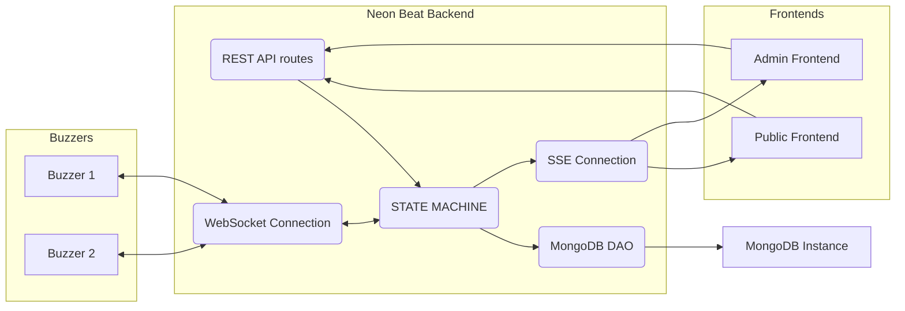
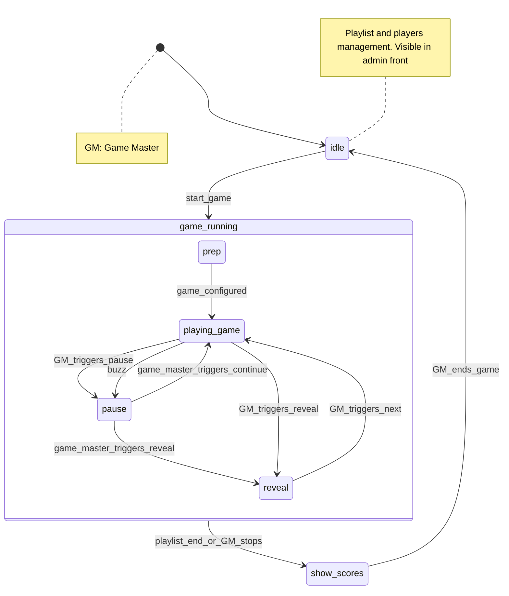

# Neon Beat back

Neon Beat back is the Rust backend powering Neon Beat, a homemade blind test experience built around playlists, teams, and fast-paced buzzer rounds.

## Highlights

- **RESTful API**: Provides a well-defined RESTful API for programmatic access to its functionalities.
- **Real-time communications**: Real-time communications via WebSockets for buzzers and Server-Sent Events for the public and admin UIs.
- **MongoDB persistence**: Uses a MongoDB connection to keep playlists, teams, and game progress in sync. Playlists are stored in their own collection so games can reuse curated track lists without re-importing them each time.
- **Swagger UI**: The full OpenAPI document is generated with utoipa and served through Swagger UI (`/docs`) for quick manual testing.

## Architecture Overview

### Module layout
The Neon Beat back project follows a layered architecture, separating concerns into distinct modules:
- **`routes`**: This layer handles incoming HTTP requests and defines the API endpoints. It is responsible for parsing requests, calling the appropriate service methods, and returning HTTP responses.
- **`services`**: This layer contains the business logic of the application. It orchestrates operations, interacts with the `dao` layer to retrieve or store data, and applies any necessary transformations or validations.
- **`dao` (Data Access Object)**: This layer is responsible for interacting with external data sources or systems, such as a MongoDB database. It abstracts the details of data persistence and retrieval from the service layer.
  - **`models`**: This submodule within the `dao` layer defines the data models that represent the entities and structures used when interacting with external systems. These models ensure consistent data representation across the application's interactions with various data sources.
- **`dto` (Data Transfer Object)**: This layer defines the data structures used for transferring data between different layers of the application, particularly between the `routes` and `services` layers, and for external API communication. These structures ensure consistent data formats.
- **`state`**: Centralises runtime state kept in memory while the server runs. It exposes the finite-state machine that coordinates gameplay, the in-memory `GameSession`/playlist data used by services and DTOs, the SSE hubs, and shared resources such as buzzer connections.

### System interactions


### Game state flow


## Core gameplay features

- **Playlist import & persistence**: JSON playlists where each song has some basic properties and are persisted atomically:
   - Timestamp at which the song should start
   - Time to identify a song
   - Song URL
   - "Point fields" are fields to find for the song, that can give points to a team: for example, song name and artist (this list of field is dynamic and not empty)
   - "Bonus point fields" are optional fields to find for the song, that can give bonus points to a team (this list of field is dynamic and may be empty)
   - During game bootstrap the playlist song order is shuffled once to create a random play sequence; persisted games must provide the same identifiers to guarantee consistency.
- **Game bootstrap**: Game can be created or loaded (from database) during the idle state:
   - the game contains a list of players (players have a unique buzzer, a name and a score)
   - the game references a persisted playlist entity (shared across games) which is embedded into the runtime session when the game starts
   - the game contains a game state (frequently saved in database), which contains a playlist state (the playlist state remembers whether a song has been played or not) and must match the playlist identifiers exactly
- **State machine execution**: Gameplay transitions follow the diagram above (`Game state flow`), persisting progress and orchestrating pauses, reveals, and scoring.
- **Admin controls (REST)**:
   - create/load games return a `GameSummary` payload bundling players, shuffled playlist ordering, and timestamps
   - pause the current song
   - resume the current song
   - add/remove points to a team
   - reveal the current song
   - mark a field as "found"
   - validate/invalidate an answer
- **Public API (REST)**: 
   - get teams infos
   - get current song infos
- **WebSocket connection for buzzers**
   - Buzzers connect to `GET /ws` and identify themselves by sending:
     ```json
     { "type": "identification", "id": "<mac_address>" }
     ```
     where `<mac_address>` is a 12-character lowercase hex string.
   - Buzz events reuse the same id:
     ```json
     { "type": "buzz", "id": "<mac_address>" }
     ```
   - Buzzers need to be informed when:
      - Game is paused and it's the team's turn to answer
      - Team's turn is finished and the game resumes
- **SSE connection for frontends**: Admin and public frontends subscribe via `/sse/admin` and `/sse/public`. The admin stream issues a one-time token and enforces a single active admin connection.

## Getting started

### Prerequisites
- Rust toolchain (1.85+ recommended)
- MongoDB instance reachable at `MONGO_URI`

### Build from source
```bash
cargo build
```
Binaries live under `target/debug/neon-beat-back` or `target/release/neon-beat-back`.

### Environment

The server relies on a running MongoDB instance and the following optional environment variables:

| Variable     | Default                     | Description |
|--------------|-----------------------------|-------------|
| `MONGO_URI`  | `mongodb://localhost:27017` | Connection string used to create the MongoDB client. |
| `MONGO_DB`   | `neon_beat`                 | Database name (only used when provided). |
| `PORT`       | `8080`                      | TCP port the HTTP server binds to. `SERVER_PORT` is also honoured for compatibility. |

### Run locally
1. Ensure MongoDB is running (configure `MONGO_URI`/`MONGO_DB` if needed).
2. Start the backend:
   ```bash
   cargo run
   ```
3. Try a few entry points:
   - Healthcheck: `curl http://localhost:8080/healthcheck`
   - Public SSE stream: `curl -N http://localhost:8080/sse/public`
   - Admin SSE stream (one active client): `curl -N http://localhost:8080/sse/admin`
   - WebSocket buzzer (after `cargo install websocat`):
     ```bash
     ( printf '{"type":"identification","id":"deadbeef0001"}\n'; cat ) | websocat -t ws://localhost:8080/ws
     ```
   - Swagger UI: open `http://localhost:8080/docs`

### Docker

Build the release image with Docker:

```bash
docker build -t neon-beat-back .
```

For cross-compilation, provide a Rust target triple via the optional build argument:

```bash
docker build -t neon-beat-back --build-arg BUILD_TARGET=aarch64-unknown-linux-gnu .
```

When using docker-compose (e.g. after copying `docker-compose.example.yaml` as `docker-compose.yaml`), the same argument can be passed through an environment variable:

```bash
BUILD_TARGET=aarch64-unknown-linux-gnu docker compose build
```

## Roadmap

- [x] Implement the Rest API with a /healthcheck route
- [x] Implement the WebSocket connection
- [x] Implement the SSE connection
- [x] Implement the MongoDB connection bootstrap
- [x] Implement the Swagger UI documentation
- [x] MongoDB auto-reconnection
- [x] Admin SSE deconnexion management
- [x] Do not block start of app if connexion to MongoDB fails (Authorize "degraded mode" → info to send by SSE)
- [x] Implement Game State Machine
- [x] Implement Game & Playlist State save in DB (only found songs, not every answered field)
- [x] Save in memory (not in DB) found point fields and bonus point fields for the current song
- [x] Implement buzzer feedback: apply GameEvent::Pause(PauseKind::Buzz) ; return true if it's the team's turn to answer, else return false
- [x] Implement SSE public events:
   - [x] game created/loaded: send teams
   - [x] point field / bonus point field found: send the list of point field / bonus point field (name only) found
   - [x] validate/invalidate answer: send true or false
   - [x] add/remove points for a team: send the points to add (or remove) to a team (player id)
   - [x] game phase changed to new phase: playing (with next song or not), pause, reveal, scores (list of teams with their scores), idle
- [x] Implement SSE admin events:
   - [x] game phase changed to new phase: playing (with next song or not), pause, reveal, scores (list of teams with their scores), idle
- [x] Implement admin routes:
   - [x] get games: OUTPUT is games IDs and names
   - [x] get playlists: OUTPUT is playlists IDs and names
   - [x] create playlist: INPUT is PlaylistInput ; save the playlist in DB ; OUTPUT is the PlaylistSummary
   - [x] load game: INPUT is the game ID ; OUTPUT is the GameSummary and PlaylistSummary ; apply GameEvent::StartGame
   - [x] create game with new playlist: INPUT is CreateGameWithPlaylistRequest ; OUTPUT is the GameSummary and PlaylistSummary ; apply GameEvent::StartGame
   - [x] create game with existing playlist ID: INPUT is CreateGameRequest ; OUTPUT is the GameSummary and PlaylistSummary ; apply GameEvent::StartGame
   - [x] start game: OUTPUT is song to be found ; apply GameEvent::GameConfigured
   - [x] pause: OUTPUT is "paused" message ; apply GameEvent::Pause(PauseKind::Manual)
   - [x] mark field as found: OUTPUT is the list of found fields ; only possible in GamePhase::GameRunning and if GameRunningPhase is not GameRunningPhase::Prep
   - [x] validate/invalidate answer: OUTPUT is "answered" message ; only possible in GamePhase::GameRunning(GameRunningPhase::Paused)
   - [x] add/remove points for a team: OUTPUT is the new score of the team ; only possible in GamePhase::GameRunning
   - [x] resume: OUTPUT is "resumed" message ; apply GameEvent::ContinuePlaying
   - [x] reveal: OUTPUT is "revealed" message ; apply GameEvent::Reveal
   - [x] next: OUTPUT is the next song to be found ; if playlist is not completed, apply GameEvent::NextSong, increment GameSession's current_song_index and reset the found fields for the current song ; else apply GameEvent::Finish(FinishReason::PlaylistCompleted)
   - [x] stop: OUTPUT is the list of teams with their scores ; apply GameEvent::Finish(FinishReason::ManualStop)
   - [x] end game: OUTPUT is "ended" message ; apply GameEvent::EndGame
- [x] Use Game State Machine
- [x] Document the new admin endpoints (OpenAPI/utoipa)
- [x] Raise an error if the playlist is empty during GameSession/Playlist creation/loading
- [ ] Migrate from MongoDB to CouchDB
- [ ] Implement a transaction system for state machine (prepare, to know if it is possible, then apply the waiting transaction when we have finished the processing)
- [ ] Implement public routes:
   - [ ] get teams/players
   - [ ] get song to find (& found fields)
   - [ ] get game phase
- [ ] Reorganize routes if required
- [ ] Add middleware for admin routes (check token)
- [ ] Validate the Rest API /healthcheck route
- [ ] Validate the WebSocket connection
- [ ] Validate the SSE connection
- [ ] Validate the MongoDB connection
- [ ] Allow to create a game in degraded mode (save the session & playlist later)
- [ ] Better management for panics
- [ ] When a buzzer has the right to answer, send info to others that they don't have the right to buzz yet. When the buzzer ended its turn, send info to others that they  have the right to buzz now.
- [ ] Allow to switch buzzer_id for a player
- [ ] Update `mongo` value of `AppState ` to None (and send False to `degraded` watcher) each time a mongo function returns a connection error
- [ ] Remove useless features of dependencies if found
- [ ] Implement tests

## Questions

- Do we want to manage public SSE deconnexion ? No
- Do we want to modify a playlist when it is already imported in the backend ? No, we import again
- Do we want to add a timeout when a player has buzzed (to resume the game) ? Add an int config property (default: Infinite)
- Do we want to prevent the previous buzzer to buzz again ? Add a bool config property (default: re-buzz authorized)
- Do we want to serve the OpenAPI documentation as a Github Page ?

