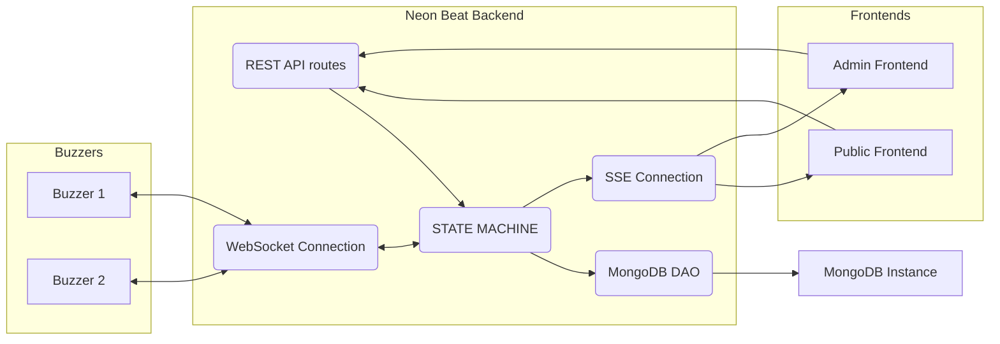
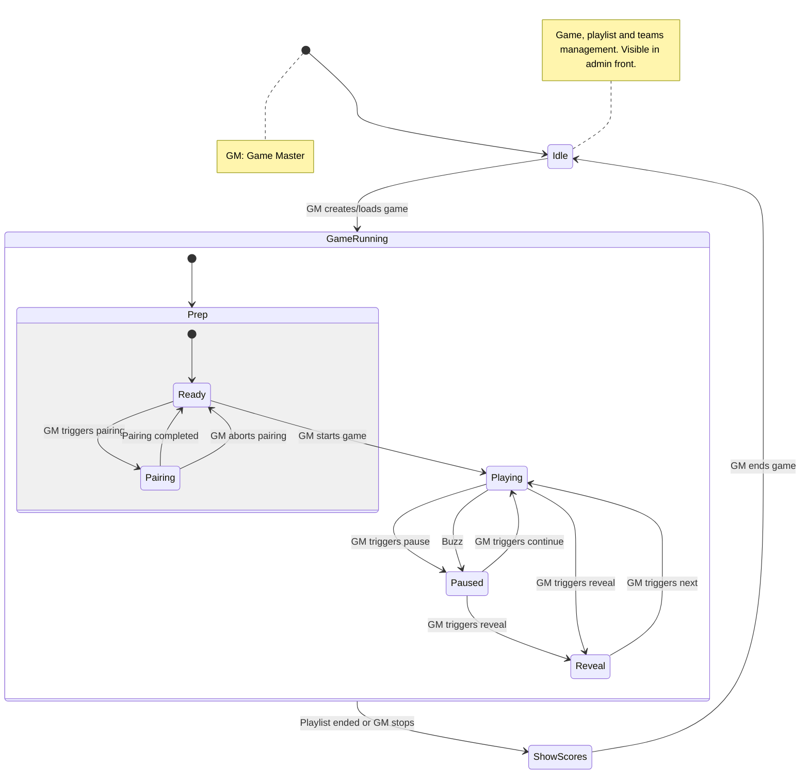
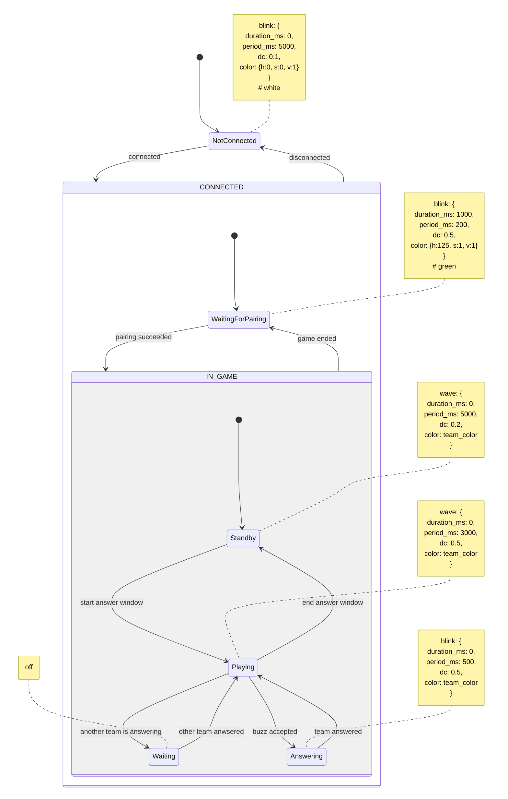

# Neon Beat back

Neon Beat back is the Rust backend powering Neon Beat, a homemade blind test experience built around playlists, teams, and fast-paced buzzer rounds.

See [CHANGELOG](CHANGELOG.md) for detailed release notes.

## Highlights

- **RESTful API**: Provides a well-defined RESTful API for programmatic access to its functionalities.
- **Real-time communications**: Real-time communications via WebSockets for buzzers and Server-Sent Events for the public and admin UIs.
- **Configurable persistence**: Build with MongoDB or CouchDB support and select the active store per deployment. Keeps playlists, teams, and game progress in sync. Playlists are stored in their own collection so games can reuse curated track lists without re-importing them each time.
- **Swagger UI**: The full OpenAPI document is generated with utoipa and served through Swagger UI (`/docs`) for quick manual testing.

## Utilities

### `tool-colors-gen`

The repository contains a small helper binary that generates curated color assets (HTML previews and JSON exports) for teams.

- Build/run (feature-gated):  
  `cargo run --bin tool-colors-gen --no-default-features --features tool-colors-gen`
- Output location: `${CARGO_TARGET_DIR:-target}/tool-colors-gen/`

The command writes both HTML grids and JSON files in that directory and prints the exact paths once generation completes.

## Configuration

Team colors and buzzer patterns (and future runtime knobs) are read from a JSON file at startup:

- Default location: `config/app.json`
- Override: set the `NEON_BEAT_BACK_CONFIG_PATH` environment variable to point at any JSON file

If the file is absent or malformed the backend continues with the built-in defaults so you can run the server without creating a config file. To customise values, drop a file with the following shape:

```json
{
   "colors": [
      { "hue": -64.69388, "saturation": 1.0, "value": 1.0 },
      { "hue": 119.331474, "saturation": 1.0, "value": 1.0 }
   ],
   "patterns": {
      "waiting_for_pairing": {
         "type": "blink",
         "duration_ms": 1000,
         "period_ms": 200,
         "dc": 0.5
      }
   }
}
```

When teams are created without an explicit color, the first unused color from the colors set is assigned automatically (falling back to white if every entry is already taken). Buzzer patterns follow the same principle: any preset omitted from the config falls back to the built-in defaults shown above. To force a fixed color, add an optional `"static_color": { "hue": ..., "saturation": ..., "value": ... }` property next to the timing fields.

### Pattern presets and types

You can override the following pattern templates in the `patterns` section:

- `waiting_for_pairing`
- `standby`
- `playing`
- `answering`
- `waiting`

Each entry accepts:

- `type`: one of `"blink"`, `"wave"`, or `"off"`.
- `duration_ms`: duration before the effect stops (`0` = infinite).
- `period_ms`: full cycle length in milliseconds (for blink/wave).
- `dc`: duty cycle between `0.0` and `1.0`.
- `static_color` (optional): HSV object overriding the team colour for this pattern.

## Architecture Overview

### Module layout
The Neon Beat back project follows a layered architecture, separating concerns into distinct modules:
- **`routes`**: This layer handles incoming HTTP requests and defines the API endpoints. It is responsible for parsing requests, calling the appropriate service methods, and returning HTTP responses.
- **`services`**: This layer contains the business logic of the application. It orchestrates operations, interacts with the `dao` layer to retrieve or store data, and applies any necessary transformations or validations.
- **`dao` (Data Access Object)**: This layer is responsible for interacting with external data sources or systems, such as a MongoDB database. It abstracts the details of data persistence and retrieval from the service layer.
  - **`models`**: This submodule within the `dao` layer defines the data models that represent the entities and structures used when interacting with external systems. These models ensure consistent data representation across the application's interactions with various data sources.
- **`dto` (Data Transfer Object)**: This layer defines the data structures used for transferring data between different layers of the application, particularly between the `routes` and `services` layers, and for external API communication. These structures ensure consistent data formats.
- **`state`**: Centralises runtime state kept in memory while the server runs. It exposes the finite-state machine that coordinates gameplay, the in-memory `GameSession`/playlist data used by services and DTOs, the SSE hubs, and shared resources such as buzzer connections.

### System interactions


### Persistence Architecture

The persistence layer implements a sophisticated coordination mechanism to balance data consistency with database efficiency. This architecture is critical for preventing data loss while avoiding database overload during rapid-fire updates (e.g., score adjustments via REST API or WebSocket events).

#### Key Mechanisms

**1. Debouncing**

The system implements debouncing to handle rapid successive updates efficiently:

```
Timeline with 200ms cooldown:

T=0ms:   persist_team() → Saves to DB immediately ✓
T=50ms:  persist_team() → Stores as pending, schedules flush at T=200ms
T=100ms: persist_team() → Replaces pending (latest state wins)
T=150ms: persist_team() → Replaces pending (latest state wins)
T=200ms: Flush task → Saves final state (T=150 data) to DB ✓

Result: Only 2 DB writes for 4 update requests, with NO data loss!
```

**How it works:**
- **Immediate persist**: If no recent save occurred, data is written immediately
- **Pending storage**: Updates during cooldown are stored in memory
- **Single flush task**: Only one background task is spawned per cooldown window
- **Latest wins**: Subsequent updates replace the pending value
- **Guaranteed save**: Flush task ensures the final state is persisted after cooldown

**2. Per-Team Locking**

Write operations use fine-grained locking to prevent conflicts while maintaining concurrency:
- **Different teams** can persist simultaneously (parallel writes)
- **Same team updates** are serialized to avoid CouchDB revision conflicts
- **Global game lock** prevents concurrent full-game saves

**3. Optimistic Retry**

CouchDB write operations automatically retry on 409 (conflict) errors:
- Exponential backoff: 50ms → 100ms → 200ms → 400ms
- Applied to: game saves, team saves, playlist saves
- Delete operations intentionally fail on conflict (semantic correctness)

**4. Graceful Shutdown**

When the server receives a shutdown signal (SIGTERM/Ctrl+C):
1. Pending game save is flushed (if present)
2. All pending team updates are flushed
3. Cooldown checks are bypassed for immediate persistence
4. Detailed logs report success/failure for each flush
5. Application exits cleanly after all data is saved

#### Guarantees

- ✅ **Eventual consistency**: All updates are eventually persisted
- ✅ **No data loss**: Updates during cooldown are tracked and saved
- ✅ **Latest state wins**: Most recent data is always the final state
- ✅ **No redundant tasks**: Only one flush task per cooldown window
- ✅ **Graceful shutdown**: Pending data is never lost on restart

#### Tradeoffs

- ⏱️ **Slight delay**: Updates may take up to 200ms to persist
- 🧠 **Memory overhead**: Pending updates are held in memory
- 🔧 **Complexity**: More sophisticated than simple throttling

#### Configuration

- **Cooldown duration**: 200ms (hardcoded, prevents >5 writes/sec per entity)
- **Retry attempts**: 4 attempts with exponential backoff
- **Concurrency**: Per-team locking allows parallel team updates

This architecture ensures that the system can handle high-frequency updates (e.g., rapid score changes, buzzer events) without overwhelming the database or losing any data, even during ungraceful shutdowns.

### Game state flow


### Buzzer state flow


## Core gameplay features

- **Playlist import & persistence**: JSON playlists where each song has some basic properties and are persisted atomically:
   - Timestamp at which the song should start
   - Time to identify a song
   - Song URL
   - "Point fields" are fields to find for the song, that can give points to a team: for example, song name and artist (this list of field is dynamic and not empty)
   - "Bonus point fields" are optional fields to find for the song, that can give bonus points to a team (this list of field is dynamic and may be empty)
   - During game bootstrap the playlist song order is shuffled once to create a random play sequence; persisted games must provide the same identifiers to guarantee consistency.
- **Game bootstrap**: Game can be created or loaded (from database) during the idle state:
   - the game contains a list of teams (teams have a unique buzzer, a name and a score)
   - the game references a persisted playlist entity (shared across games) which is embedded into the runtime session when the game starts [**WARNING**: the game considers currently that the playlist doesn't change !]
   - the game contains a game state (frequently saved in database), which contains a playlist state (the playlist state remembers whether a song has been played or not) and must match the playlist identifiers exactly
   - new Game+ behaviour: if a playlist was completed in a prior game session, starting a this game session will treat it as a fresh run.
- **State machine execution**: Gameplay transitions follow the diagram above (`Game state flow`), persisting progress and orchestrating pauses, reveals, and scoring.
- **Admin controls (REST)**:
   - create/load games return a `GameSummary` payload bundling teams, shuffled playlist ordering, and timestamps
   - pause the current song
   - resume the current song
   - add/remove points to a team
   - optionally shuffle the playlist when starting a game via `POST /admin/game/start?shuffle=true` (only if the playlist has not started or was completed)
   - update team metadata (buzzer id, name, score)
   - reveal the current song
   - mark a field as "found"
   - validate/invalidate an answer
   - delete stored games when they are not the active running session
- **Prep-phase team pairing**:
   - allow creating/updating/deleting teams while the state machine is `GameRunning::Prep`
   - enforce that buzzers are paired (or explicitly in pairing mode) before transitioning to `Playing`
   - expose admin endpoints to enter/abort pairing mode, snapshot teams, and reassign buzzers with SSE notifications
   - support rollback of pairing operations to restore the last known good snapshot on failure
- **Public API (REST)**:
   - get teams infos
   - get current song infos
   - get current game phase (with degraded flag)
- **WebSocket connection for buzzers**
   - Buzzers connect to `GET /ws` and identify themselves by sending:
     ```json
     { "type": "identification", "id": "<mac_address>" }
     ```
     where `<mac_address>` is a 12-character lowercase hex string.
   - Buzz events reuse the same id:
     ```json
     { "type": "buzz", "id": "<mac_address>" }
     ```
   - Buzzers need to be informed when:
      - Game is paused and it's the team's turn to answer
      - Team's turn is finished and the game resumes
- **SSE connection for frontends**: Admin and public frontends subscribe via `/sse/admin` and `/sse/public`. The admin stream issues a one-time token and enforces a single active admin connection.

## Pairing workflow

The buzzer pairing workflow lives inside the finite state machine so that API calls, SSE notifications, and WebSocket feedback stay in lock-step. A typical session looks like this:

1. **Kick off pairing**
   ```bash
   curl -X POST http://localhost:8080/admin/teams/pairing \
     -H 'content-type: application/json' \
     -d '{ "first_team_id": "<uuid-of-team-to-start-with>" }'
   ```
   - The game enters `GameRunning::Prep(Pairing)` and snapshots the roster.
   - Public and admin SSE streams broadcast `pairing.waiting` with the team that must claim a buzzer next.

2. **Assign a buzzer**
   - The highlighted team presses its buzzer (or an operator can simulate it).  
   - The WebSocket client sends `{ "type": "buzz", "id": "<12-char buzzer id>" }`.
   - The backend:
     - Assigns the buzzer while clearing any conflicting assignment.
     - Replies to the device with a `BuzzerOutboundMessage` payload so hardware can give immediate confirmation.
     - Emits `pairing.assigned` containing the team UUID and the new buzzer ID.  
     - Emits another `pairing.waiting` if more unpaired teams remain; otherwise it transitions back to `prep_ready`.

3. **Handle deletions mid-pairing**
   - `DELETE /admin/teams/{team_id}` now emits a lightweight `team.deleted` event on the public SSE stream.  
   - If the removed team was the one currently pairing, the server automatically advances to the next unpaired team (broadcast through `pairing.waiting`) or ends pairing if everyone is assigned.

4. **Abort pairing**
   ```bash
   curl -X POST http://localhost:8080/admin/teams/pairing/abort
   ```
   - Restores the snapshot captured when pairing began.
   - Emits `pairing.restored` with the full roster before returning to `prep_ready`.
   - Returns the restored roster as an array of `TeamSummary` objects so UIs can resynchronise without waiting for SSE.

Public clients can still poll `/public/pairing-status`, but reacting to the SSE stream keeps both admin and public UIs in sync without reloading the complete roster.

## Realtime interfaces

### WebSocket `/ws` (buzzers)

Buzzers maintain a single long-lived WebSocket connection. Each device **must** identify itself before sending buzz events.

| Direction | Message type | Payload example | Notes |
|-----------|--------------|-----------------|-------|
| client → server | `{"type":"identification","id":"deadbeef0001"}` | 12 lowercase hex characters | Required immediately after connecting. |
| client → server | `{"type":"buzz","id":"deadbeef0001"}` | must reuse the identification id | Ignored unless the game is in `prep_ready`, `prep_pairing`, or `playing`. |
| server → client | `{"pattern":{"type":"blink","details":{"duration_ms":1000,"period_ms":200,"dc":0.5,"color":{"h":125.0,"s":1.0,"v":1.0}}}}` (`BuzzerOutboundMessage`) | – | Sent when identification succeeds and whenever the buzzer has to change its pattern (type can be `blink`, `wave` or `off`). |
| server → client | WebSocket close frame | – | Connection closed by the backend (e.g. admin kicked, duplicate connection); client should retry with exponential backoff. |

Messages tagged with any other `type` are ignored.

More details on the JSON messages exchanged with buzzer devices
------------------------------------------------------------

The WebSocket endpoint is intentionally simple: buzzer devices send two kinds of messages (identification and buzz) and the server sends pattern updates that instruct the buzzer firmware how to display LED effects. All messages are JSON text frames.

1) Inbound messages (device → server)

- Identification (must be the first message after opening the socket)

   JSON schema:

   {
      "type": "identification",
      "id": "<12-lower-hex>"
   }

   Example:

   {
      "type": "identification",
      "id": "deadbeef0001"
   }

   Notes:
   - The `id` must be a 12-character lowercase hexadecimal string (no separators). The server enforces this and will close the connection if the id is invalid or missing.
   - The server waits up to 10 seconds for this first message and will drop the connection on timeout.

- Buzz

   JSON schema:

   {
      "type": "buzz",
      "id": "<same-id-as-identification>"
   }

   Example:

   {
      "type": "buzz",
      "id": "deadbeef0001"
   }

   Notes:
   - The `id` must match the id previously provided in the identification message. Buzzes with a mismatched id are ignored.
   - Buzz events are processed only when the game is in a phase where buzzes are meaningful (prep-ready, pairing, or playing). Other phases result in the buzz being ignored.

2) Outbound messages (server → device)

The server uses a single outbound message type, `BuzzerOutboundMessage`, which instructs the buzzer firmware to update its visual pattern. The JSON is a single object with a `pattern` field; that field is a tagged enum describing one of three pattern kinds: `blink`, `wave`, or `off`.

JSON shape (high level):

{
   "pattern": {
      "type": "blink" | "wave" | "off",
      "details": { /* present for blink/wave */ }
   }
}

Detailed fields
- `pattern.type` — string: one of `"blink"`, `"wave"`, or `"off"`.
- `pattern.details` — object (only present for `blink` and `wave`):
   - `duration_ms`: integer, effect duration in milliseconds (`0` = infinite)
   - `period_ms`: integer, period of one cycle in milliseconds
   - `dc`: float, duty-cycle between `0.0` and `1.0`
   - `color`: HSV object `{ "h": float, "s": float, "v": float }` where `h` is hue, `s` is saturation and `v` is value/brightness.

Examples

- Blink pattern example (waiting for pairing):

   {
      "pattern": {
         "type": "blink",
         "details": {
            "duration_ms": 1000,
            "period_ms": 200,
            "dc": 0.5,
            "color": { "h": 125.0, "s": 1.0, "v": 1.0 }
         }
      }
   }

- Wave pattern example (team standby):

   {
      "pattern": {
         "type": "wave",
         "details": {
            "duration_ms": 0,
            "period_ms": 5000,
            "dc": 0.2,
            "color": { "h": 30.0, "s": 1.0, "v": 1.0 }
         }
      }
   }

- Off pattern example:

   {
      "pattern": { "type": "off" }
   }

When these messages are sent
- Immediately after a successful identification the server responds with a `BuzzerOutboundMessage` representing the current pattern the device should show. This gives immediate feedback to the user that the device is connected and recognised.
- During pairing the server sends a `Standby`/`WaitingForPairing` pattern to newly assigned buzzers and may switch other buzzers to `Off` or `Waiting` presets as required.
- During normal gameplay the server pushes `Playing`, `Answering`, and `Waiting` presets to devices so the firmware can reflect whether a team is active, answering, or idle.

Device behaviour expectations
- On receiving a `pattern` object the device should apply the visual effect immediately and keep it for `duration_ms` (or until a new pattern arrives). If `duration_ms` is `0` the effect is indefinite until overridden.
- The device should treat any invalid JSON frame as ignorable and close the socket if the server sends a close frame.
- On unexpected disconnection, buzzer firmware should attempt to reconnect with exponential backoff.

Pattern presets and the HSV colour object are derived from the application config; see `config/app.json` and `src/dto/ws.rs` for the exact `BuzzerPattern` shapes.

Quick sequence example
1. Device opens WebSocket to `/ws`.
2. Device sends: `{ "type": "identification", "id": "deadbeef0001" }`.
3. Server replies with current pattern: `{ "pattern": { "type": "blink", "details": { ... } } }`.
4. When user presses buzzer, device sends: `{ "type": "buzz", "id": "deadbeef0001" }`.
5. Server processes buzz and may reply with a new pattern (e.g. `answering`) and triggers SSE events so UIs update.


### Server-Sent Events

Two SSE streams are available:

- `GET /sse/public` – no authentication, receives public updates.
- `GET /sse/admin` – requires a single active client; the first event contains an admin token that must be echoed by the frontend on subsequent REST calls.

Every connection begins with a `handshake` event:

```json
event: handshake
data: {"stream":"public","message":"public stream connected","degraded":false}
```

Admin streams include an extra `token` field in the same payload. When the storage backend drops out of availability the server emits `system_status` events:

```json
event: system_status
data: {"degraded":true}
```

The remaining events represent gameplay changes. Payload types are defined in `src/dto/sse.rs`.

| Event name | Payload | Stream(s) | Description |
|------------|---------|-----------|-------------|
| `fields_found` | `FieldsFoundEvent` | public | Updated list of discovered point/bonus fields for the current song. |
| `answer_validation` | `AnswerValidationEvent` | public | Indicates the validation result: `"correct"`, `"incomplete"`, or `"wrong"`. |
| `score_adjustment` | `TeamSummary` | public | Broadcast after manual score changes. |
| `phase_changed` | `PhaseChangedEvent` | public + admin | FSM transition (optionally includes song snapshot, scoreboard, and paused buzzer id). |
| `team.created` | `TeamCreatedEvent` | public + admin | Newly created team (payload wraps a `TeamSummary`). |
| `team.updated` | `TeamUpdatedEvent` | public | Existing team metadata changed (name, buzzer, or score). |
| `team.deleted` | `TeamDeletedEvent` | public | Team removed; payload only contains the team UUID. |
| `game.session` | `GameSummary` | public | Full game snapshot (teams, playlist ordering, timestamps). |
| `pairing.waiting` | `PairingWaitingEvent` | public + admin | Announces which team should pair a buzzer next. |
| `pairing.assigned` | `PairingAssignedEvent` | public + admin | Confirms a buzzer assignment during pairing. |
| `pairing.restored` | `PairingRestoredEvent` | public | Snapshot broadcast after aborting pairing. |
| `test.buzz` | `TestBuzzEvent` | public + admin | Emitted when a prep-mode test buzz is detected. |

Keep-alive comments are sent every 15 seconds so most SSE clients will stay connected by default.

#### Admin API authentication

All `/admin/**` routes now require the token issued by the admin SSE stream. After a client connects to `/sse/admin`, the initial `handshake` event includes a `token` field. Subsequent admin REST requests must supply this value in the `X-Admin-Token` header (case insensitive). Requests without a token, or with a stale token after the SSE stream disconnects, receive `401 Unauthorized`.

## Getting started

### Prerequisites
- Rust toolchain (1.85+ recommended)
- MongoDB instance reachable at `MONGO_URI`

### Build from source
```bash
cargo build
```
Binaries live under `target/debug/neon-beat-back` or `target/release/neon-beat-back`.

### Environment

The server relies on a running MongoDB instance and the following optional environment variables:

| Variable     | Default                     | Description |
|--------------|-----------------------------|-------------|
| `MONGO_URI`  | `mongodb://localhost:27017` | Connection string used to create the MongoDB client. |
| `MONGO_DB`   | `neon_beat`                 | Database name (only used when provided). |
| `COUCH_BASE_URL` | – | Base URL for the CouchDB server (e.g. `http://localhost:5984`). |
| `COUCH_DB`   | – | Database name created/used by the Couch backend. |
| `COUCH_USERNAME` /<br>`COUCH_PASSWORD` | – | Optional basic-auth credentials for CouchDB. |
| `NEON_STORE` | – | Required when both backends are compiled; set to `mongo` or `couch` to choose the store at runtime. If only one backend was compiled, the value is optional but must match when supplied. |
| `PORT`       | `8080`                      | TCP port the HTTP server binds to. `SERVER_PORT` is also honoured for compatibility. |

### Selecting a storage backend

The backend ships with both storage implementations enabled by default. At startup:

- If both features were compiled, set `NEON_STORE=mongo` or `NEON_STORE=couch` to choose the active store.
- If only one feature was compiled (for a slimmer binary), `NEON_STORE` is optional, but any value you supply must still match the compiled backend.

To build the binary with a single backend you can rely on Cargo features:

```bash
# Mongo-only build
cargo build --release --no-default-features --features mongo-store

# Couch-only build
cargo build --release --no-default-features --features couch-store
```

### Run locally
1. Decide which store to use and start the matching database:
   - **MongoDB**: `export NEON_STORE=mongo` (when both backends are compiled) and ensure `MONGO_URI`/`MONGO_DB` point to a running instance.
   - **CouchDB**: `export NEON_STORE=couch` (when both backends are compiled) and set `COUCH_BASE_URL`/`COUCH_DB` plus credentials if required.
   - If the binary was built with only one backend, `NEON_STORE` can be omitted; it defaults to the compiled store.
2. Start the backend:
   ```bash
   cargo run
   ```
3. Try a few entry points:
   - Healthcheck: `curl http://localhost:8080/healthcheck`
   - Public SSE stream: `curl -N http://localhost:8080/sse/public`
   - Admin SSE stream (one active client): `curl -N http://localhost:8080/sse/admin`
   - WebSocket buzzer (after `cargo install websocat`):
     ```bash
     ( printf '{"type":"identification","id":"deadbeef0001"}\n'; cat ) | websocat -t ws://localhost:8080/ws
     ```
   - Swagger UI: open `http://localhost:8080/docs`

### Docker

Build the release image with Docker:

```bash
docker build -t neon-beat-back .
```

To ship an image with a single backend, pass the feature flags through the build argument `CARGO_FEATURES` (the value is appended to each Cargo invocation):

```bash
# Mongo-only image
docker build -t neon-beat-back \
  --build-arg CARGO_FEATURES="--no-default-features --features mongo-store" .

# Couch-only image
docker build -t neon-beat-back \
  --build-arg CARGO_FEATURES="--no-default-features --features couch-store" .
```

For cross-compilation, provide a Rust target triple via the optional build argument:

```bash
docker build -t neon-beat-back --build-arg BUILD_TARGET=aarch64-unknown-linux-gnu .
```

When using docker-compose (e.g. after copying `docker-compose.example.yaml` as `docker-compose.yaml`), the same argument can be passed through an environment variable:

```bash
BUILD_TARGET=aarch64-unknown-linux-gnu docker compose build
```

## Roadmap

- [x] Implement the Rest API with a /healthcheck route
- [x] Implement the WebSocket connection
- [x] Implement the SSE connection
- [x] Implement the MongoDB connection bootstrap
- [x] Implement the Swagger UI documentation
- [x] MongoDB auto-reconnection
- [x] Admin SSE deconnexion management
- [x] Do not block start of app if connexion to MongoDB fails (Authorize "degraded mode" → info to send by SSE)
- [x] Implement Game State Machine
- [x] Implement Game & Playlist State save in DB (only found songs, not every answered field)
- [x] Save in memory (not in DB) found point fields and bonus point fields for the current song
- [x] Implement buzzer feedback: apply GameEvent::Pause(PauseKind::Buzz) ; return true if it's the team's turn to answer, else return false
- [x] Implement SSE public events:
   - [x] game created/loaded: send teams
   - [x] point field / bonus point field found: send the list of point field / bonus point field (name only) found
   - [x] validate/invalidate answer: send one of `"correct"`, `"incomplete"` or `"wrong"`
   - [x] add/remove points for a team: send the points to add (or remove) to a team (team id)
   - [x] game phase changed to new phase: playing (with next song or not), pause, reveal, scores (list of teams with their scores), idle
- [x] Implement SSE admin events:
   - [x] game phase changed to new phase: playing (with next song or not), pause, reveal, scores (list of teams with their scores), idle
- [x] Implement admin routes:
   - [x] get games: OUTPUT is games IDs and names
   - [x] get playlists: OUTPUT is playlists IDs and names
   - [x] create playlist: INPUT is PlaylistInput ; save the playlist in DB ; OUTPUT is the PlaylistSummary
   - [x] load game: INPUT is the game ID ; OUTPUT is the GameSummary and PlaylistSummary ; apply GameEvent::StartGame
   - [x] create game with new playlist: INPUT is CreateGameWithPlaylistRequest ; OUTPUT is the GameSummary and PlaylistSummary ; apply GameEvent::StartGame
   - [x] create game with existing playlist ID: INPUT is CreateGameRequest ; OUTPUT is the GameSummary and PlaylistSummary ; apply GameEvent::StartGame
   - [x] start game: OUTPUT is song to be found ; apply GameEvent::GameConfigured
   - [x] pause: OUTPUT is "paused" message ; apply GameEvent::Pause(PauseKind::Manual)
   - [x] mark field as found: OUTPUT is the list of found fields ; only possible in GamePhase::GameRunning and if GameRunningPhase is not GameRunningPhase::Prep(_)
   - [x] validate/invalidate answer: OUTPUT is "answered" message ; only possible in GamePhase::GameRunning(GameRunningPhase::Paused)
   - [x] add/remove points for a team: OUTPUT is the new score of the team ; only possible in GamePhase::GameRunning
   - [x] resume: OUTPUT is "resumed" message ; apply GameEvent::ContinuePlaying
   - [x] reveal: OUTPUT is "revealed" message ; apply GameEvent::Reveal
   - [x] next: OUTPUT is the next song to be found ; if playlist is not completed, apply GameEvent::NextSong, increment GameSession's current_song_index and reset the found fields for the current song ; else apply GameEvent::Finish(FinishReason::PlaylistCompleted)
   - [x] stop: OUTPUT is the list of teams with their scores ; apply GameEvent::Finish(FinishReason::ManualStop)
   - [x] end game: OUTPUT is "ended" message ; apply GameEvent::EndGame
- [x] Use Game State Machine
- [x] Document the new admin endpoints (OpenAPI/utoipa)
- [x] Raise an error if the playlist is empty during GameSession/Playlist creation/loading
- [x] Add song ID to MarkFieldRequest
- [x] Implement a transaction system for state machine (prepare, to know if it is possible, then apply the waiting transaction when we have finished the processing)
- [x] Migrate from MongoDB to CouchDB
- [x] Support multiple DB and choose the one at buildtime or runtime
- [x] Team management & team/buzzer pairing
- [x] Implement public routes:
   - [x] get teams
   - [x] get song to find (& found fields)
   - [x] get game phase
- [x] Implement GET /admin/games/:id route
- [x] Add game_id to GET /public/phase route
- [x] INFO logs by default (not debug)
- [x] Implement buzzer testing during GamePhase::GameRunning(GameRunningPhase::Prep(_)) (test buzz)
- [x] Add middleware for admin routes (check token)
- [x] Rename Player to Team (or find a new name)
- [x] Review TeamInput: is buzzer_id really needed ?
- [x] Validate the Rest API /healthcheck route
- [x] Validate the WebSocket connection
- [x] Validate the SSE connection
- [x] Validate the CouchDB connection
- [x] Add DELETE /admin/games/:id route
- [x] Replace boolean value of POST /admin/game/answer route by a tri-state value (Correct, Incomplete, Wrong)
- [x] Add shuffle query param to /admin/start and shuffle the songs (if requester) at start, not game creation
- [x] Keep playlist song order (from given JSON) if no shuffle
- [x] Log a warning if a connected buzzer is not paired while launching the game
- [x] Implement a TryFrom instead of `impl From<(GameListItemEntity, PlaylistEntity)> for GameListItem` (compare playlist IDs)
- [x] Remove unecessary pub(crate) functions
- [x] Replace Vec<Team> by IterMap
- [x] Migrate from DashMap to HashMap if DashMap is useless
- [x] Fix bug: a buzz of an unpaired buzzer during PrepReady makes the game broken
- [x] Send the team who buzzed in the GET phase route and the SSE event
- [x] When entering in the Reveal phase, save the information (in order to know it if we restart the session)
- [x] Define color for teams (HSV) -> split the spectrum in 20 hues
- [x] Send pattern to WS
- [x] Fix error when too many score adjust are requested :
   - [x] Re-model the data to avoid hotspots: separate Team from Game DB documents
   - [x] Coordinate persistence operations with locking and throttling
   - [x] Optimistic-retry for some CouchDB write operations
   - [x] Debounce persistence operations on game store
- [x] Return an error if shuffle is requested but not possible
- [ ] Reject unknown/unexpected fields for query/path params with `#[serde(deny_unknown_fields)]`
- [ ] Bugfix : an admin SSE WiFi deconnexion seems to lock the backend
- [ ] On a buzzer reconnexion, send back its pattern
- [ ] Be able to reveal during Pause phase
- [ ] Add another Pause phase between Reveal and Playing
- [ ] If a buzzer enters inhibited mode, send the information to SSE streams (public & admin)
- [ ] Return errors if path or query parameter is not managed
Erreur si param non attendu ?
- [ ] Better management for panics & expects
- [ ] Less info logs (only connected/disconnected)
- [ ] Improve error codes
   - [ ] If there is no game: do not send 404 for GET Teams
- [x] During Pause event, do not send song to SSE
- [ ] SSE public GameSession & NextSong: remove field responses
- [ ] Mark field found: send response to public SSE
- [ ] New route: POST song hint
- [ ] Once a team answered, it can be locked (until another team buzzes or the next song), depending on a game_start boolean parameter
- [ ] Refactor TeamSummary (duplicate struct)
- [ ] Add axum validation
- [ ] Add more logs
- [ ] Serve the OpenAPI documentation as a Github Page
- [ ] Debounce device buzzes (~250 ms) during pairing to avoid double assigns
- [ ] Reorganize routes if required
- [ ] Better management for errors
- [ ] Send encountered errors to admin SSE during WS handles
- [ ] Create game/playlist IDs from store
- [ ] Allow to create a game in degraded mode (save the session & playlist later)
- [ ] When a buzzer has the right to answer, send info to others that they don't have the right to buzz yet. When the buzzer ended its turn, send info to others that they have the right to buzz now.
- [ ] Update `game_store` value of `AppState ` and send False to `degraded` watcher each time a GameStore function returns a connection error ?
- [ ] Remove useless features of dependencies if found
- [ ] Implement tests

## Questions

- Do we want to manage public SSE deconnexion ? No
- Do we want to modify a playlist when it is already imported in the backend ? No, we import again
- Do we want to add a timeout when a team has buzzed (to resume the game) ? Add an int config property (default: Infinite)
- Do we want to prevent the previous buzzer to buzz again ? Add a bool config property (default: re-buzz authorized)
- Do we want Game and Playlist name unicity ? No
- Do we want to raise an error if a connected buzzer is not paired while launching the game ? No
