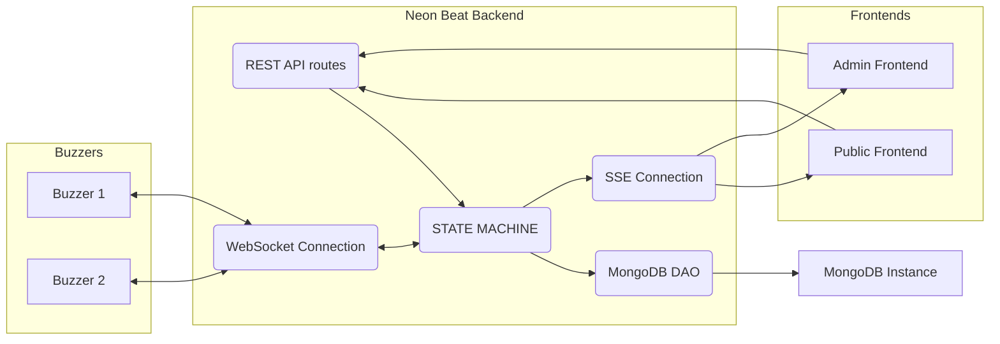
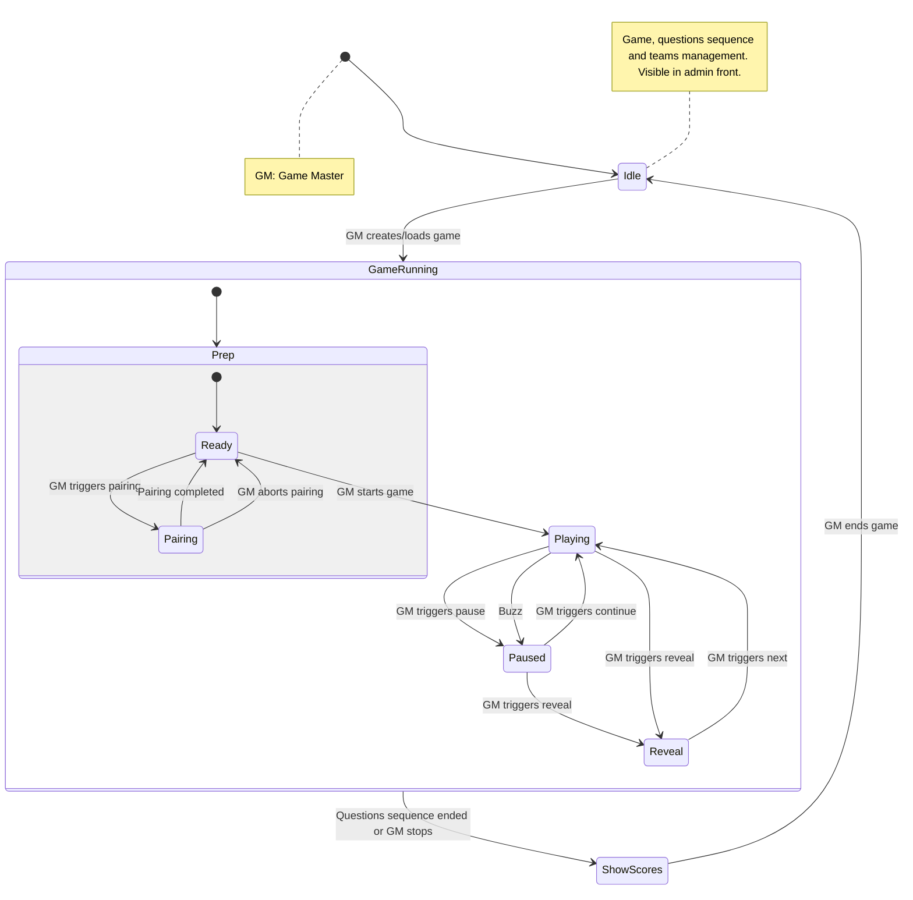
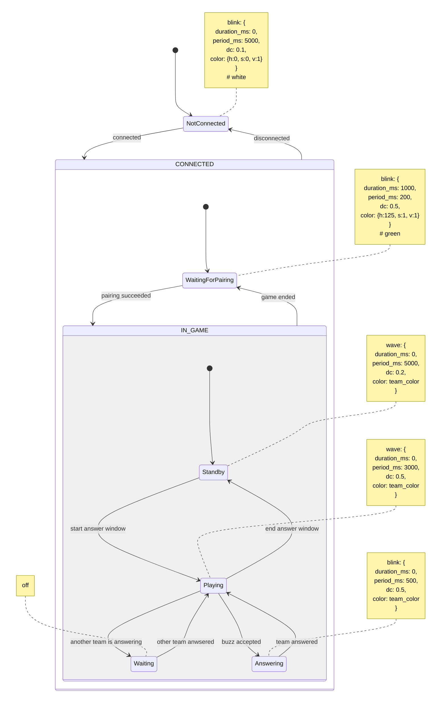

# Neon Beat back

[](https://github.com/neon-beat/neon-beat-back/releases)
[](https://www.rust-lang.org/)
[](LICENSE)

> A real-time Rust backend for homemade quiz games, featuring blindtest, multiple-choice, and open-text questions with WebSocket buzzer integration, Server-Sent Events for live updates, and flexible MongoDB/CouchDB persistence.
Built for fast-paced trivia with automatic state management and buzzer pairing workflows.

📖 **[API Documentation](https://neon-beat.github.io/neon-beat-back/)** - Full OpenAPI/Swagger documentation deployed on GitHub Pages

See [CHANGELOG](CHANGELOG.md) for detailed release notes.

## Highlights

- **RESTful API**: Comprehensive REST API with admin and public endpoints for game management, team operations, score adjustments, and game state control.
- **Real-time communications**: WebSocket connections for buzzer devices with automatic reconnection support, plus Server-Sent Events (SSE) for public and admin UIs with automatic degraded mode handling.
- **Configurable persistence**: Build with MongoDB or CouchDB support and select the active store per deployment. Features automatic database reconnection and graceful degraded mode when storage is temporarily unavailable. Questions sequences are stored in their own collection so games can reuse curated quiz content without re-importing it each time.
- **Advanced state machine**: Finite state machine managing the complete game lifecycle with transaction-based transitions, robust pairing workflow, and persistence of game progress across restarts.
- **Team & buzzer management**: Complete team lifecycle management (create, update, delete) during prep phase, with buzzer pairing workflow that supports rollback and conflict resolution.
- **Swagger UI**: The full OpenAPI document is generated with utoipa and served through Swagger UI (`/docs`) for quick manual testing, or view it on [GitHub Pages](https://neon-beat.github.io/neon-beat-back/).
- **Flexible sequence handling**: Support for question shuffling at game creation/load time while preserving original ordering when not shuffled, with smart "New Game+" behavior for completed sequences.

---

## Quick Start

### Running with Docker

The fastest way to get started is with Docker. The backend ships with both MongoDB and CouchDB support.

**Build the image:**
```bash
docker build -t neon-beat-back .
```

**Run with Docker Compose:**
```bash
# Start with the CouchDB compose file, or copy docker-compose.mongodb-example.yaml for MongoDB
cp docker-compose.couchdb-example.yml docker-compose.yaml

# Start the services
docker compose up --build
```

The backend will be available at `http://localhost:8080`. Try these endpoints:
- Swagger UI: `http://localhost:8080/docs`
- Health check: `curl http://localhost:8080/healthcheck`
- Public SSE stream: `curl -N http://localhost:8080/sse/public`

**Advanced Docker options:**

Single backend builds (smaller images):
```bash
# MongoDB only
docker build -t neon-beat-back \
  --build-arg CARGO_FEATURES="--no-default-features --features mongo-store" .

# CouchDB only
docker build -t neon-beat-back \
  --build-arg CARGO_FEATURES="--no-default-features --features couch-store" .
```

Cross-compilation for different architectures:
```bash
# ARM64 build
docker build -t neon-beat-back --build-arg BUILD_TARGET=aarch64-unknown-linux-gnu .

# With docker-compose
BUILD_TARGET=aarch64-unknown-linux-gnu docker compose build
```

### Building from Source

**Prerequisites:**
- Rust toolchain (1.85+ recommended)
- MongoDB or CouchDB instance

**Standard build:**
```bash
cargo build --release --bin neon-beat-back
```

Binaries will be in `target/release/neon-beat-back`.

**Single backend builds (smaller binaries):**
```bash
# MongoDB only
cargo build --release --bin neon-beat-back --no-default-features --features mongo-store

# CouchDB only
cargo build --release --bin neon-beat-back --no-default-features --features couch-store
```

**Cross-compilation:**
```bash
# Install target (example for ARM64)
rustup target add aarch64-unknown-linux-gnu

# Build for target
cargo build --release --bin neon-beat-back --target aarch64-unknown-linux-gnu

# Binary will be in target/aarch64-unknown-linux-gnu/release/neon-beat-back
```

### Configuration Basics

The backend requires a database connection. Set environment variables before running:

**For MongoDB:**
```bash
export NEON_STORE=mongo  # when both backends are compiled
export MONGO_URI=mongodb://localhost:27017
export MONGO_DB=neon_beat
```

**For CouchDB:**
```bash
export NEON_STORE=couch  # when both backends are compiled
export COUCH_BASE_URL=http://localhost:5984
export COUCH_DB=neon_beat
export COUCH_USERNAME=admin
export COUCH_PASSWORD=password
```

**Run the backend:**
```bash
cargo run --release
# or
./target/release/neon-beat-back
```

See [Configuration Reference](#configuration-reference) for all environment variables, team colors, buzzer patterns, and more.

---

## Architecture

### Module layout
The Neon Beat back project follows a layered architecture, separating concerns into distinct modules:
- **`routes`**: This layer handles incoming HTTP requests and defines the API endpoints. It is responsible for parsing requests, calling the appropriate service methods, and returning HTTP responses.
- **`services`**: This layer contains the business logic of the application. It orchestrates operations, interacts with the `dao` layer to retrieve or store data, and applies any necessary transformations or validations.
- **`dao` (Data Access Object)**: This layer is responsible for interacting with external data sources or systems, such as a MongoDB database. It abstracts the details of data persistence and retrieval from the service layer.
  - **`models`**: This submodule within the `dao` layer defines the data models that represent the entities and structures used when interacting with external systems. These models ensure consistent data representation across the application's interactions with various data sources.
- **`dto` (Data Transfer Object)**: This layer defines the data structures used for transferring data between different layers of the application, particularly between the `routes` and `services` layers, and for external API communication. These structures ensure consistent data formats.
- **`state`**: Centralises runtime state kept in memory while the server runs. It exposes the finite-state machine that coordinates gameplay, the in-memory `GameSession`/questions sequence data used by services and DTOs, the SSE hubs, and shared resources such as buzzer connections.

### System interactions

```mermaid
flowchart LR
    subgraph Neon Beat Backend
        REST(REST API routes) --> StateMachine(STATE MACHINE)
        WS(WebSocket Connection) <--> StateMachine
        StateMachine --> MongoDbDao(MongoDB DAO)
        StateMachine --> SSE(SSE Connection)
    end

    subgraph Frontends
        PublicFront[Public Frontend] --> REST
        AdminFront[Admin Frontend] --> REST
        SSE --> PublicFront
        SSE --> AdminFront
    end

    subgraph Buzzers
        Buzzer1[Buzzer 1] <--> WS
        Buzzer2[Buzzer 2] <--> WS
    end

    MongoDbDao --> MongoDbInstance[MongoDB Instance]
```

### Game state flow

```mermaid
stateDiagram-v2
   [*] --> Idle

   note right of [*]
      GM: Game Master
   end note
   note left of Idle
      Game, questions sequence and teams management. Visible in admin front.
   end note

   Idle --> GameRunning: GM creates/loads game
   state GameRunning {
      [*] --> Prep
      state Prep {
         [*] --> Ready
         Ready --> Pairing: GM triggers pairing
         Pairing --> Ready: Pairing completed
         Pairing --> Ready: GM aborts pairing
         Ready --> Playing: GM starts game
      }
      Playing --> Paused: GM triggers pause
      Playing --> Paused: Buzz
      Paused --> Reveal: GM triggers reveal
      Paused --> Playing: GM triggers continue
      Reveal --> Playing: GM triggers next
      Playing --> Reveal: GM triggers reveal
   }
   GameRunning --> ShowScores: Questions sequence ended or GM stops
   ShowScores --> Idle: GM ends game
```

### Buzzer state flow

```mermaid
stateDiagram-v2
   [*] --> NotConnected
   NotConnected --> CONNECTED: connected
   CONNECTED --> NotConnected: disconnected

   state CONNECTED {
      [*] --> WaitingForPairing
      WaitingForPairing --> IN_GAME: pairing succeeded
      IN_GAME --> WaitingForPairing: game ended

      state IN_GAME {
         [*] --> Standby
         Standby --> Playing: start answer window
         Playing --> Standby: end answer window
         Playing --> Waiting: another team is answering
         Waiting --> Playing: other team anwsered
         Playing --> Answering: buzz accepted
         Answering --> Playing: team answered
      }
   }
   note left of NotConnected
      blink: {
         duration_ms: 0,
         period_ms: 5000,
         dc: 0.1,
         color: {h:0, s:0, v:1}
      }
      # white
   end note
   note left of WaitingForPairing
      blink: {
         duration_ms: 1000,
         period_ms: 200,
         dc: 0.5,
         color: {h:125, s:1, v:1}
      }
      # green
   end note
   note left of Standby
      wave: {
         duration_ms: 0,
         period_ms: 5000,
         dc: 0.2,
         color: team_color
      }
   end note
   note left of Playing
      wave: {
         duration_ms: 0,
         period_ms: 3000,
         dc: 0.5,
         color: team_color
      }
   end note
   note left of Answering
      blink: {
         duration_ms: 0,
         period_ms: 500,
         dc: 0.5,
         color: team_color
      }
   end note
   note left of Waiting
      off
   end note
```

---

## Core Features

### Questions Sequence & Game Management

- **Questions sequence import & persistence**: JSON sequences contain ordered questions and are persisted atomically:
   - Blindtest questions with time to answer, media URL, start timestamp, answer map, points, and bonus answer markers
   - Multiple-choice questions with time to answer, prompt, optional URL, up to four answers, correctness flags, and hints
   - Open questions with time to answer, prompt, optional URL, accepted answers, and hints
   - Answers and hints receive auto-assigned `u8` IDs at import time
   - During game creation/loading, the question order can be optionally shuffled via the `shuffle` query parameter; if not shuffled, the original JSON order is preserved. Once persisted, games maintain their defined question order across restarts.
   - Questions sequences are validated at import time to prevent empty sequences and empty answer sets.
- **Game bootstrap**: Game can be created or loaded (from database) during the idle state:
   - the game contains a list of teams (teams have a unique buzzer, a name and a score)
   - the game references a persisted questions sequence entity (shared across games) which is embedded into the runtime session when the game starts
   - the game contains a game state (frequently saved in database), which contains sequence progress (the sequence state remembers whether a question has been answered or not) and must match the question identifiers exactly
   - **New Game+ behavior**: if a sequence was completed in a prior game session, starting this game session will treat it as a fresh run with all questions available again.

### State Machine & Game Flow

- **State machine execution**: Gameplay transitions follow the diagram above (`Game state flow`), persisting progress and orchestrating pauses, reveals, and scoring with transaction-based state planning (prepare/apply/abort).
- **Real-time game state tracking**: Current question progress tracked in memory including:
   - Found answer IDs and revealed hint IDs for active questions
   - Question revelation state (persisted to support server restarts)
   - Team turn management during pause phases

### Team & Buzzer Management

- **HSV team colors**: Teams are automatically assigned colors from a configurable HSV spectrum (default: 20 hues evenly distributed), with fallback to white when all colors are taken.
- **Prep-phase team pairing**:
   - Allow creating/updating/deleting teams while the state machine is `GameRunning::Prep`
   - Enforce that buzzers are paired (or explicitly in pairing mode) before transitioning to `Playing`
   - Expose admin endpoints to enter/abort pairing mode, snapshot teams, and reassign buzzers with SSE notifications
   - Support rollback of pairing operations to restore the last known good snapshot on failure
   - Handle mid-pairing team deletions gracefully by auto-advancing to the next unpaired team
- **Test buzzing**: Buzzers can be tested during `Prep` phase (non-pairing mode) with `test.buzz` SSE events emitted to both public and admin streams.

### REST API

📖 **Complete API documentation** available via Swagger UI at `/docs` or on [GitHub Pages](https://neon-beat.github.io/neon-beat-back/).

**Admin endpoints** (require authentication via SSE token):
- **Game & sequence management**: create, load, delete, and list games and questions sequences
- **Game flow control**: start, pause, resume, reveal, next question, stop, and end game
- **Team management**: create, update, and delete teams during prep phase
- **Scoring & answer tracking**: adjust team scores, mark answers as found, reveal hints, validate answers with tri-state feedback (correct/incomplete/wrong)
- **Pairing workflow**: start and abort buzzer pairing sessions with rollback support

**Public endpoints** (no authentication):
- Get teams information, current question details (with found answer and hint IDs), and game phase
- Health checks, system status, and pairing status queries

**Input validation**:
- Unknown or unexpected query/path parameters are rejected with `400 Bad Request`
- Required fields are validated for presence and format
- Question IDs, team IDs, and questions sequence IDs are validated against the current game session
- Shuffle parameter can only be used when appropriate (e.g., cannot shuffle mid-game)

### Real-time Interfaces

The system provides two real-time protocols for keeping all clients synchronized:

**WebSocket (`/ws`) for buzzers:**
- Physical devices connect and identify with 12-character hex MAC address
- Send buzz events when pressed during pairing or gameplay
- Receive LED pattern commands (blink, wave, off) with HSV color
- Automatic pattern synchronization on reconnection
- Patterns change based on game phase and buzzer state

**Server-Sent Events (`/sse/*`) for frontends:**
- **Public stream** (`/sse/public`): 15 event types, no authentication required
- **Admin stream** (`/sse/admin`): 7 event types, token authentication, single connection enforced
- Events cover game lifecycle, team changes, pairing workflow, and gameplay updates
- Admin token issued on handshake for authenticating REST API calls

📡 **[Complete protocol documentation →](PROTOCOLS.md)** - Full message formats, authentication flow, testing guides, and examples

---

## Configuration Reference

### Environment Variables

#### Database Configuration

| Variable     | Default                     | Description |
|--------------|-----------------------------|-------------|
| `MONGO_URI`  | `mongodb://localhost:27017` | Connection string for MongoDB client |
| `MONGO_DB`   | `neon_beat`                 | Database name for MongoDB |
| `COUCH_BASE_URL` | – | Base URL for CouchDB server (e.g. `http://localhost:5984`) |
| `COUCH_DB`   | – | Database name for CouchDB backend |
| `COUCH_USERNAME` / `COUCH_PASSWORD` | – | Optional basic-auth credentials for CouchDB |
| `NEON_STORE` | – | Storage backend selection: `mongo` or `couch` (required when both are compiled) |

#### Server Configuration

| Variable     | Default                     | Description |
|--------------|-----------------------------|-------------|
| `PORT`       | `8080`                      | HTTP server port (`SERVER_PORT` also supported) |

#### Application Configuration

| Variable     | Default                     | Description |
|--------------|-----------------------------|-------------|
| `NEON_BEAT_BACK_CONFIG_PATH` | `config/app.json` | Path to application config file (team colors, buzzer patterns, etc.) |
| `RUST_LOG`   | `info`                      | Logging level (e.g., `debug`, `info`, `warn`, `error`). Supports module-specific levels like `neon_beat_back=debug` |

### Storage Backend Selection

The binary ships with both MongoDB and CouchDB support by default. Use the `NEON_STORE` environment variable to select which backend to use at runtime:

- When **both** backends are compiled: Set `NEON_STORE=mongo` or `NEON_STORE=couch`
- When **single** backend is compiled: `NEON_STORE` is optional but must match if supplied

### Team Colors

Teams are automatically assigned colors from a configurable HSV spectrum defined in `config/app.json`:
- **Default**: 20 hues evenly distributed across the spectrum
- **Fallback**: White when all colors are taken

### Buzzer Patterns

Buzzer LED patterns are configurable in `config/app.json`:
- **Pattern types**: `blink` (on/off toggle), `wave` (breathing effect), `off`
- **Timing parameters**: `duration_ms` (0 = infinite), `period_ms` (cycle length)
- **Visual parameters**: `dc` (duty cycle 0.0-1.0), HSV color object
- Default patterns defined for each buzzer phase (waiting for pairing, standby, playing, answering, waiting)

See [PROTOCOLS.md](PROTOCOLS.md) for complete specifications and message formats.

---

## Development

### Prerequisites
- Rust toolchain 1.85+ recommended
- MongoDB or CouchDB instance
- (Optional) `websocat` for WebSocket testing: `cargo install websocat`

### Testing the API

Once the server is running (see [Quick Start](#quick-start)), try these endpoints:

**Health check:**
```bash
curl http://localhost:8080/healthcheck
```

**Connect to public SSE stream:**
```bash
curl -N http://localhost:8080/sse/public
```

**Connect to admin SSE stream (single connection enforced):**
```bash
curl -N http://localhost:8080/sse/admin
# Save the token from the handshake event for admin REST calls
```

**Test WebSocket buzzer connection:**
```bash
( printf '{"type":"identification","id":"deadbeef0001"}\n'; cat ) | websocat -t ws://localhost:8080/ws
```

**Interactive API documentation:**
Open `http://localhost:8080/docs` in your browser for Swagger UI

---

## Advanced Topics

### Persistence Architecture

The persistence layer prevents data loss while avoiding database overload through debouncing, locking, and retry mechanisms.

**Key features:**
- **Debouncing (200ms cooldown)**: Coalesces rapid updates — only 2 DB writes for 4 requests, zero data loss
- **Per-team locking**: Parallel writes for different teams, serialized for same team to avoid conflicts
- **Optimistic retry**: Automatic retry with exponential backoff (50→100→200→400ms) on CouchDB conflicts
- **Graceful shutdown**: All pending writes flushed before exit

This ensures high-frequency updates (rapid score changes, buzzer events) never overwhelm the database or lose data.

<details>
<summary><strong>View detailed architecture documentation</strong></summary>

#### Key Mechanisms

**1. Debouncing**

The system implements debouncing to handle rapid successive updates efficiently:

```
Timeline with 200ms cooldown:

T=0ms:   persist_team() → Saves to DB immediately ✓
T=50ms:  persist_team() → Stores as pending, schedules flush at T=200ms
T=100ms: persist_team() → Replaces pending (latest state wins)
T=150ms: persist_team() → Replaces pending (latest state wins)
T=200ms: Flush task → Saves final state (T=150 data) to DB ✓

Result: Only 2 DB writes for 4 update requests, with NO data loss!
```

**How it works:**
- **Immediate persist**: If no recent save occurred, data is written immediately
- **Pending storage**: Updates during cooldown are stored in memory
- **Single flush task**: Only one background task is spawned per cooldown window
- **Latest wins**: Subsequent updates replace the pending value
- **Guaranteed save**: Flush task ensures the final state is persisted after cooldown

**2. Per-Team Locking**

Write operations use fine-grained locking to prevent conflicts while maintaining concurrency:
- **Different teams** can persist simultaneously (parallel writes)
- **Same team updates** are serialized to avoid CouchDB revision conflicts
- **Global game lock** prevents concurrent full-game saves

**3. Optimistic Retry**

CouchDB write operations automatically retry on 409 (conflict) errors:
- Exponential backoff: 50ms → 100ms → 200ms → 400ms
- Applied to: game saves, team saves, questions sequence saves
- Delete operations intentionally fail on conflict (semantic correctness)

**4. Graceful Shutdown**

When the server receives a shutdown signal (SIGTERM/Ctrl+C):
1. Pending game save is flushed (if present)
2. All pending team updates are flushed
3. Cooldown checks are bypassed for immediate persistence
4. Detailed logs report success/failure for each flush
5. Application exits cleanly after all data is saved

#### Guarantees

- ✅ **Eventual consistency**: All updates are eventually persisted
- ✅ **No data loss**: Updates during cooldown are tracked and saved
- ✅ **Latest state wins**: Most recent data is always the final state
- ✅ **No redundant tasks**: Only one flush task per cooldown window
- ✅ **Graceful shutdown**: Pending data is never lost on restart

#### Tradeoffs

- ⏱️ **Slight delay**: Updates may take up to 200ms to persist
- 🧠 **Memory overhead**: Pending updates are held in memory
- 🔧 **Complexity**: More sophisticated than simple throttling

#### Configuration

- **Cooldown duration**: 200ms (hardcoded, prevents >5 writes/sec per entity)
- **Retry attempts**: 4 attempts with exponential backoff
- **Concurrency**: Per-team locking allows parallel team updates

</details>

### Pairing Workflow

The buzzer pairing workflow is integrated into the finite state machine to keep API calls, SSE notifications, and WebSocket feedback synchronized:

**Typical pairing session:**

1. **Start pairing** - POST `/admin/teams/pairing` with `first_team_id`
   - Game enters `GameRunning::Prep(Pairing)` and snapshots the roster
   - SSE broadcasts `pairing.waiting` with the team that must claim a buzzer next

2. **Assign buzzers** - Teams press their buzzers in sequence
   - WebSocket client sends `{"type": "buzz", "id": "<buzzer-id>"}`
   - Backend assigns buzzer, clears conflicts, and sends immediate LED confirmation
   - Emits `pairing.assigned` with team UUID and buzzer ID
   - Emits next `pairing.waiting` or transitions back to `prep_ready` when done

3. **Handle deletions mid-pairing** - DELETE `/admin/teams/{team_id}`
   - Emits lightweight `team.deleted` event on public SSE
   - Auto-advances to next unpaired team if deleted team was pairing
   - Ends pairing if all teams are assigned

4. **Abort pairing** - POST `/admin/teams/pairing/abort`
   - Restores snapshot captured when pairing began
   - Emits `pairing.restored` with full roster before returning to `prep_ready`
   - Returns restored roster so UIs can resynchronize without waiting for SSE

---

## Utilities

### OpenAPI Generator

The project includes a tool to generate the OpenAPI 3.1 specification from the Rust code (using `utoipa`). The OpenAPI spec is automatically generated and deployed to GitHub Pages by the CI workflow (`.github/workflows/docs.yml`) when changes are pushed to `main`.

**Local development with Swagger UI:**
```bash
# Generate the spec
mkdir docs && cargo run --bin openapi-generator --no-default-features > docs/openapi.json

# Download Swagger UI
cd docs
curl -L https://github.com/swagger-api/swagger-ui/archive/refs/tags/v5.10.0.tar.gz | tar xz --strip-components=2 swagger-ui-5.10.0/dist
sed -i 's|https://petstore.swagger.io/v2/swagger.json|./openapi.json|g' swagger-initializer.js

# Serve with any static file server
python -m http.server 8000
# Open http://localhost:8000
```

### Color Configuration Tool

Generate and validate HSV team color configurations:

```bash
cargo run --bin tool-colors-gen --no-default-features --features tool-colors-gen
```

Useful for customizing the team color assets while ensuring sufficient visual distinction.

---

## Roadmap

See [ROADMAP.md](ROADMAP.md) for planned features and improvements.

---

## Contributing

Contributions are welcome! Whether you're fixing bugs, adding features, or improving documentation, your help is appreciated.

**Getting started:**
1. Fork the repository
2. Create a feature branch (`git checkout -b feature/amazing-feature`)
3. Make your changes and test thoroughly
4. Commit your changes (`git commit -m 'Add amazing feature'`)
5. Push to the branch (`git push origin feature/amazing-feature`)
6. Open a Pull Request

**Development guidelines:**
- Follow existing code style and conventions
- Add tests for new features when possible
- Update documentation for API changes
- Keep commits focused and well-described

For major changes, please open an issue first to discuss what you would like to change.

---

## License

This project is licensed under the GNU General Public License v3.0 - see the [LICENSE](LICENSE) file for details.

---

## Design Decisions

This section documents key architectural and behavioral choices made during development.

**Public SSE disconnection handling:**
- Public SSE connections are not actively managed on disconnection
- Rationale: Simplifies server-side connection management for read-only public streams

**Questions sequence modification:**
- Questions sequences cannot be modified after import; re-import the sequence with changes instead
- Rationale: Ensures sequence immutability and consistency across games that reference them

**Buzzer timeout after buzz:**
- Configurable via integer property (default: Infinite)
- Rationale: Provides flexibility for different game formats and pacing preferences

**Re-buzzing prevention:**
- Configurable via boolean property (default: re-buzz authorized)
- Rationale: Allows game masters to choose between competitive urgency or giving teams multiple attempts

**Game and questions sequence name uniqueness:**
- Names are not enforced to be unique
- Rationale: Simplifies game management and allows multiple sessions with similar themes

**Unpaired buzzer validation:**
- No error raised if a connected buzzer is not paired when launching the game
- Rationale: Allows games to start with partial team rosters for flexible setup
